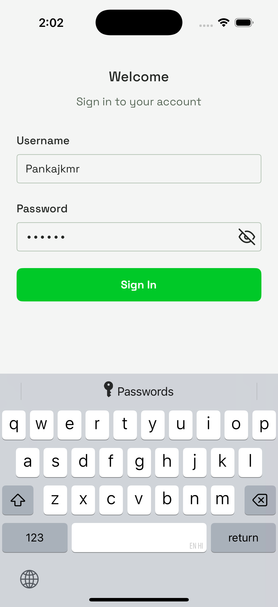
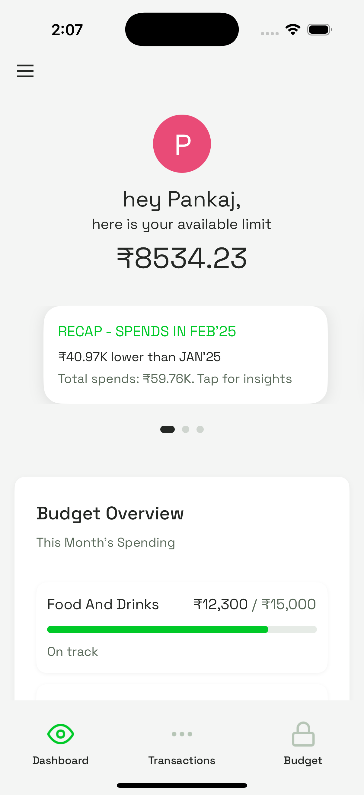
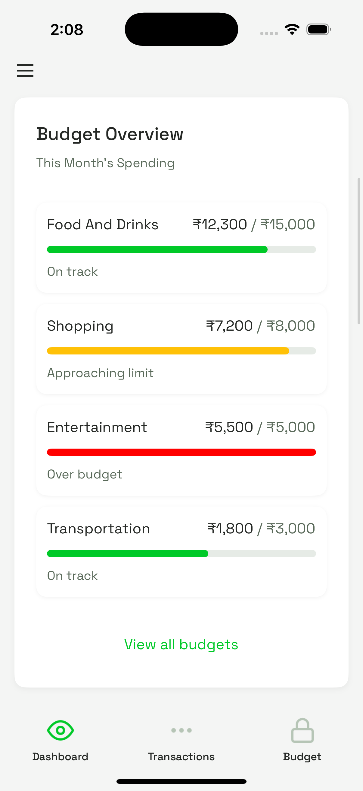
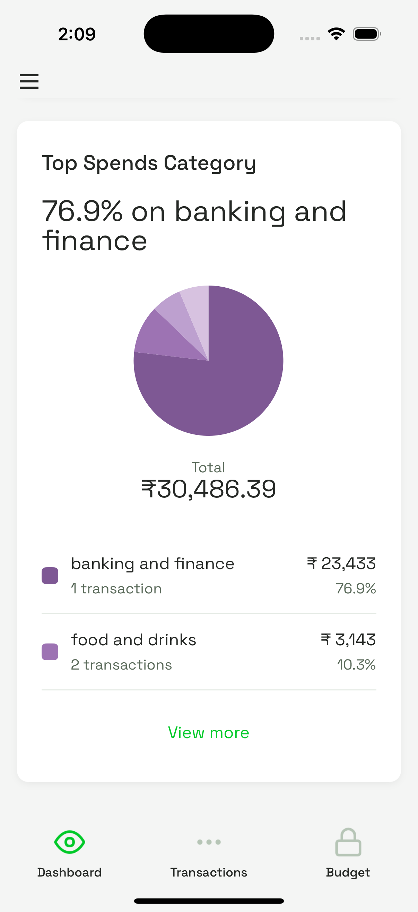
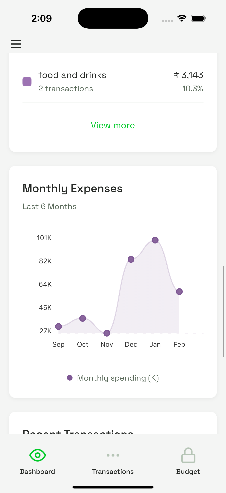
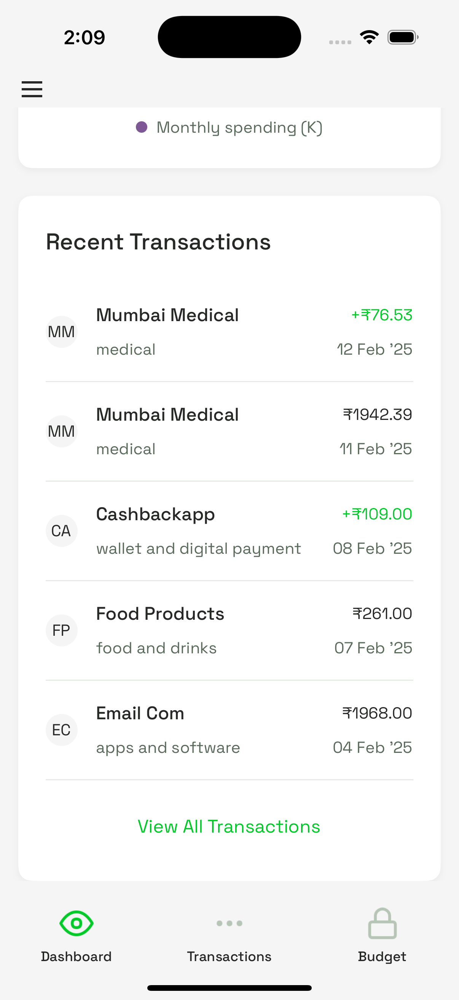
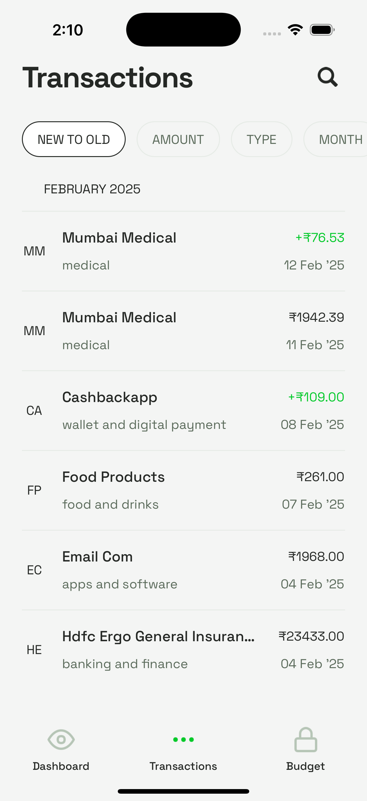
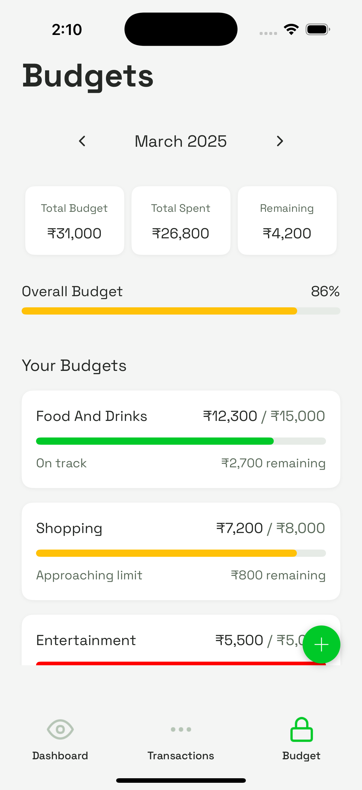
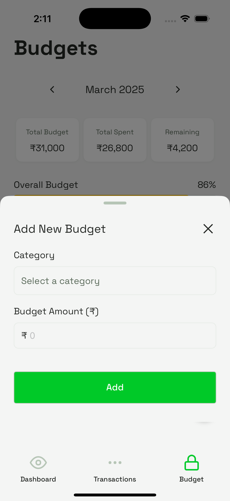
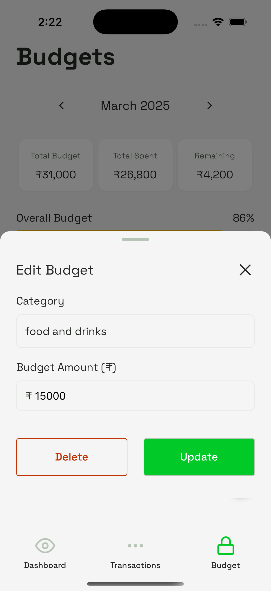

# Bright Money - Personal Finance App

A comprehensive mobile application for managing personal finances, incorporating budget tracking, expense management, and financial insights.

# Demo

## Screenshots

|                                                                       |                                                                    |                                                                      |
| --------------------------------------------------------------------- | ------------------------------------------------------------------ | -------------------------------------------------------------------- |
|          |   |      |
| Login Screen                                                          | Balance Summary                                                    | Budget Overview                                                      |
|  |   |  |
| Category Wise Expenses                                                | Monthly Expenses                                                   | Recent Transactions                                                  |
|      |  |           |
| All Transactions                                                      | Budget Management                                                  | Add Budget                                                           |
|         |                                                                    |                                                                      |
| Update/Delete Budget                                                  |                                                                    |                                                                      |


## Overview

This React Native application allows users to:

- Track their financial information including total balance and spending trends
- Manage transactions with search and filtering capabilities
- Set and monitor budgets for different spending categories
- View spending insights and analyses
- Get real-time currency exchange rates

## Features

- **Authentication**: Secure login with validation
- **Dashboard**: Financial summary with total balance, budget overview, and recent transactions
- **Transaction Management**: View, filter, search, and categorize expenses
- **Budget Tracking**: Monitor category spending with progress indicators
- **Currency Conversion**: Support for multiple currencies using real-time exchange rates
- **Performance Optimization**: Efficient data fetching and UI rendering

## Tech Stack

- **Framework**: React Native (Ignite Boilerplate)
- **State Management**: Redux Toolkit
- **Navigation**: React Navigation 6
- **Styling**: Themed components with dynamic light/dark mode support
- **API Integration**: Apisauce for API requests
- **Data Persistence**: MMKV Storage
- **Internationalization**: i18next with RTL support
- **UI Components**: Custom components based on Ignite boilerplate

## Project Structure

```
app/
├── components/      # Reusable UI components
├── config/          # App configuration
├── hooks/           # Custom React hooks
├── i18n/            # Internationalization
├── navigators/      # Navigation configuration
├── screens/         # App screens
├── services/        # API services
├── store/           # Redux store and slices
├── theme/           # Theming system
├── types/           # TypeScript type definitions
└── utils/           # Utility functions
```

## Getting Started

### Prerequisites

- Environment setup: https://reactnative.dev/docs/set-up-your-environment
- Node.js (>=20.0.0)
- npm or yarn
- iOS Simulator or Android Emulator (for mobile testing)

### Installation

1. Clone the repository:

   ```
   git clone https://github.com/yourusername/bright-money.git
   cd bright-money
   ```

2. Install dependencies:

   ```
   npm install
   ```

3. Start the development server:

   ```
   npm run start
   ```

4. Run on specific platform:

   ```
   # For iOS
   npm run ios

   # For Android
   npm run android
   ```

## Development

### Demo Credentials

For testing the app, use the following credentials:

- Username: `demo`
- Password: `password123`

### Environment Variables

The app uses environment configuration files located in `app/config/`:

- `config.base.ts`: Base configuration
- `config.dev.ts`: Development environment settings
- `config.prod.ts`: Production environment settings

### Testing

Run tests with:

```
npm test
```

## License

This project is licensed under the MIT License - see the LICENSE file for details.
